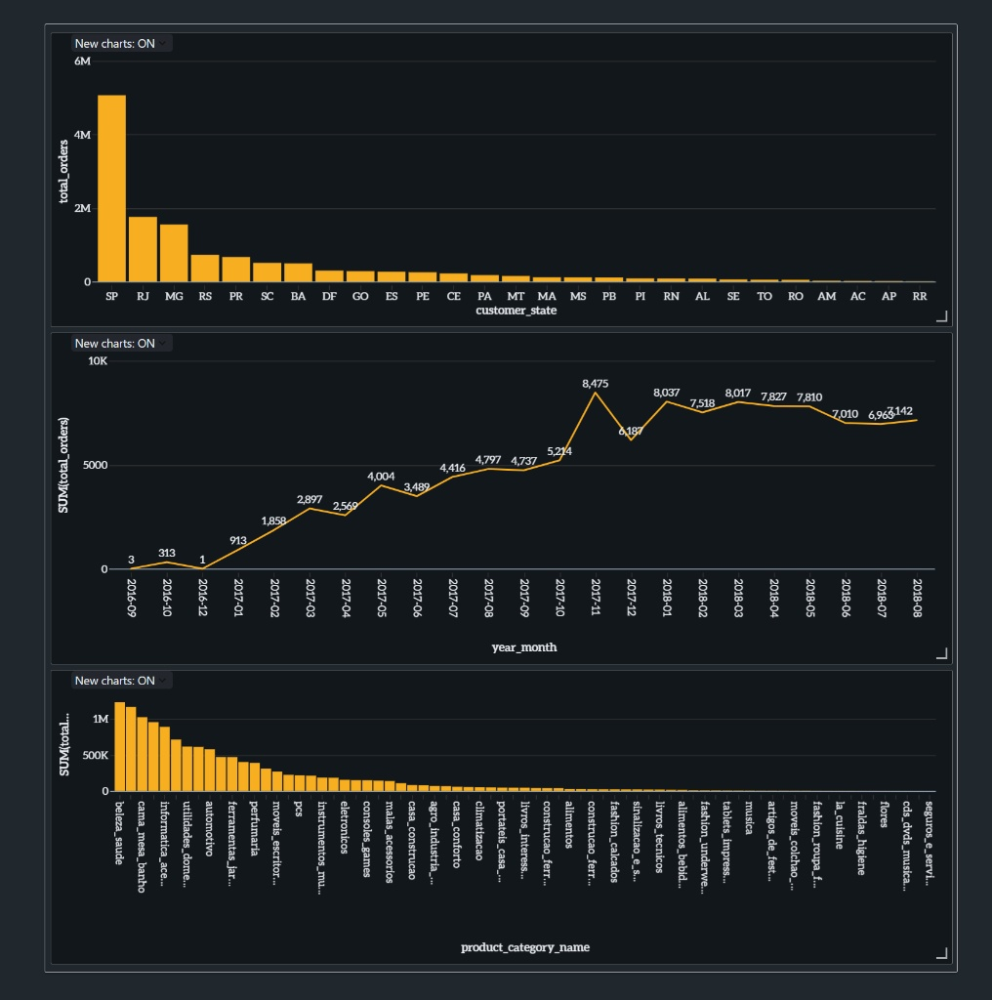

🌎 [Read in English](README_EN.md) | 🇧🇷 [Ler em Português](README.md)

# 🛒 E-Commerce Data Engineering Pipeline (Olist)

Este projeto é um pipeline de Engenharia de Dados End-to-End construído para processar dados reais do e-commerce brasileiro (Olist). O objetivo foi aplicar boas práticas de mercado estruturando os dados na **Arquitetura Medalhão (Bronze, Silver e Gold)**.

## 📊 Dashboard Final (Camada Gold)
*(Os dados abaixo foram pré-agregados no PySpark para garantir performance em milissegundos)*

  

## 🛠️ Tecnologias e Arquitetura Utilizadas
- **Ambiente:** Databricks (Cloud)
- **Linguagem:** Python (PySpark) e SQL
- **Armazenamento:** Delta Lake (Formato Otimizado)
- **Arquitetura:** Medallion Architecture 

## 🚀 O Processo (Pipeline)

1. **🥉 Camada Bronze (Raw Data):** - Ingestão dos dados transacionais puros (Pedidos, Clientes, Produtos, Itens).
   - Conversão do formato CSV para **Delta**, garantindo proteção de esquema (`overwriteSchema`) e histórico.

2. **🥈 Camada Silver (Cleansed & Conformed):**
   - Limpeza e tipagem de dados (conversão de strings para Timestamps).
   - Filtro de regra de negócio (apenas pedidos com status `delivered`).
   - Múltiplos *Joins* para enriquecimento dos dados.
   - *Resolução de problemas:* Uso rigoroso de DataFrames com *Aliases* para evitar a temida `Ambiguous Reference` do PySpark.

3. **🥇 Camada Gold (Business Aggregations):**
   - Criação de visões de negócios focadas em performance.
   - Agregações eficientes (`groupBy`, `sum`, `count`) para gerar as tabelas que alimentam o Dashboard final (Sazonalidade mensal, Faturamento por Estado, Top Categorias).

## 💡 Principais Aprendizados
Como um profissional focado em aprimoramento contínuo, este projeto me permitiu lidar com desafios reais de infraestrutura de dados. Lidei com restrições de permissões no Databricks File System (DBFS), contornei erros clássicos do Spark com *joins* complexos e entendi a importância de aplicar a proteção de esquema (*Schema Enforcement*) ao sobrescrever tabelas críticas.
